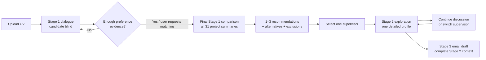
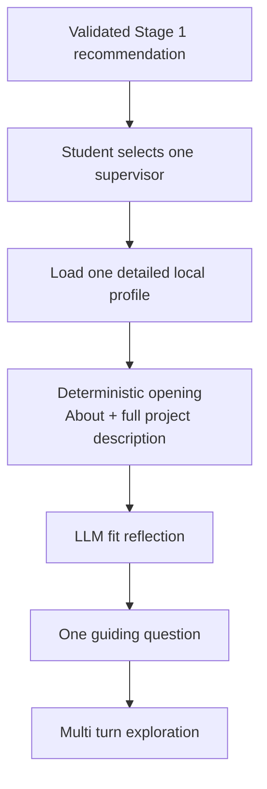
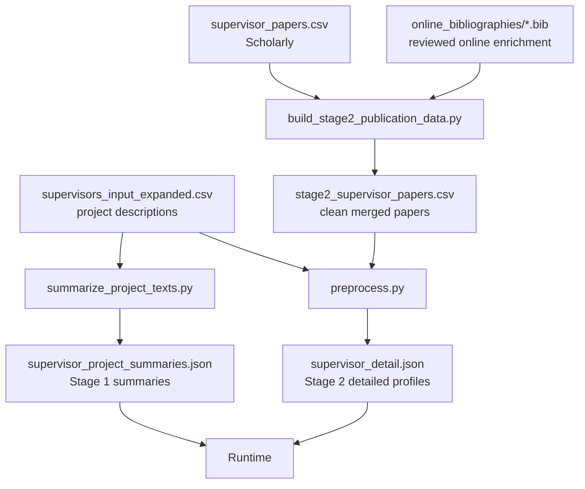

<div align="center">

# Matching LLM

### A three stage LLM framework for student supervisor matching

**Preference exploration · grounded comparison · detailed supervisor exploration · first contact email support**

<br>


</div>

---

## Overview

**Matching LLM** is a decision support system for students who need to explore a fixed set of potential dissertation supervisors.

The system does more than return a ranked list. It separates the decision process into three stages:

1. **Stage 1 — Preference exploration and matching**  
   The student uploads a CV and answers a short adaptive sequence of questions. Supervisor information is deliberately hidden during this preference exploration. Once enough student evidence has been collected, the system compares the student with all available supervisor project summaries and returns a ranked shortlist.

2. **Stage 2 — Detailed exploration of one supervisor**  
   The student selects one recommended supervisor. The system loads only that supervisor's detailed local profile, including the full stored project description and available publication evidence. It then helps the student examine the strength and form of the fit.

3. **Stage 3 — First contact email drafting**  
   The system uses the full student evidence together with the complete Stage 2 conversation to prepare a first contact email draft. The draft is intended as a starting point and should be reviewed and edited by the student before use.


> **Scope:** this repository supports individual preference formation and supervisor exploration. It is not a cohort allocation or stable matching system, and it does not replace official university information or academic judgement.

### System overview

```text
Student
  │
  ├──────────────► Browser UI
  │                server.py + static/index.html
  │
  └──────────────► CLI
                   scripts/cli.py
                         │
                         ▼
┌──────────────────────────────────────────────────────────────────────────────┐
│                         Matching LLM Runtime                                 │
│                                                                              │
│   ┌──────────────────┐      ┌──────────────────┐      ┌──────────────────┐   │
│   │     Stage 1      │ ───► │     Stage 2      │ ───► │     Stage 3      │   │
│   │ Preference +     │      │ Supervisor       │      │ First-contact    │   │
│   │ Profile Match    │      │ Exploration      │      │ Email Draft      │   │
│   └──────────────────┘      └──────────────────┘      └──────────────────┘   │
│            │                         │                         │             │
│            ▼                         ▼                         ▼             │
│   stage1-profile-match/     stage2-supervisor-       stage3-email-draft/     │
│        SKILL.md             explore/SKILL.md              SKILL.md           │
└──────────────────────────────────────────────────────────────────────────────┘
             │                         │                         ▲
             ▼                         ▼                         │
 supervisor_project_          supervisor_detail.json             │
 summaries.json               one selected full profile          │
 all 31 short summaries                 │                        │
             │                          └──────► Stage 2 conversation ──────────┘
             │
             └───────────────────────────────────────────────────────┐
                                                                     ▼
                                                        RemoteChatModel
                                                        gemma4:26b
                                                        Ollama-compatible API

Runtime rule:
  Stage 1 dialogue  → no supervisor evidence
  Stage 1 matching  → all 31 project summaries
  Stage 2           → one detailed supervisor profile
  Stage 3           → complete Stage 2 conversation + student evidence

Live student interaction performs no web search.
```

---

## At a glance

| | Current implementation |
|---|---|
| **Interaction design** | Three separate LLM stages |
| **Supervisor set** | 31 approved supervisors in the current local dataset |
| **Stage 1 dialogue** | Candidate blind preference exploration |
| **Stage 1 output** | 1–3 ranked recommendations + alternatives + exclusion explanations |
| **Stage 2 evidence** | One selected detailed supervisor profile only |
| **Stage 3 evidence** | Full student evidence + complete Stage 2 conversation |
| **Runtime model** | `gemma4:26b` through an Ollama compatible HTTP API |
| **Interfaces** | Browser interface and CLI |
| **Live web search** | None during student interaction |
| **CV formats** | PDF, DOCX, TXT |

---

## System architecture



The key design principle is **evidence separation**. Each stage receives only the information needed for its task.

### Evidence boundaries

| Operation | Student evidence | Supervisor evidence |
|---|---|---|
| **Stage 1 dialogue** | Full CV, CV keywords, optional original preference fields, conversation so far | **None** |
| **Stage 1 final comparison** | Full CV, original preference fields, complete Stage 1 dialogue | Project summaries for **all 31** supervisors |
| **Stage 2** | Explicit preferences, Stage 1 summary, student only Stage 1 messages | Detailed profile for **one selected supervisor** |
| **Stage 3** | Full CV, CV keywords, original preference fields, Stage 1 summary, all Stage 1 student messages, complete Stage 2 conversation | Supervisor evidence already contained in the Stage 2 conversation |

This separation prevents the preference interview from being guided by candidate names and reduces cross supervisor information leakage during detailed exploration.

---

## Stage 1: adaptive preference exploration and matching

Stage 1 has two distinct parts.

```text
Full CV + keywords + current student statements
                     │
                     ▼
          ┌──────────────────────┐
          │ Candidate-blind      │
          │ preference dialogue  │
          └──────────────────────┘
                     │
                     ▼
          ┌──────────────────────┐
          │ Readiness check      │
          │ from answer 4 onward │
          └──────────────────────┘
                     │
          ┌──────────┴──────────┐
          │                     │
       not ready              ready
          │                     │
          └─────── dialogue ◄────┘
                                │
                                ▼
                  ┌──────────────────────────┐
                  │ Final Stage 1 comparison │
                  │ all 31 project summaries │
                  └──────────────────────────┘
                                │
                                ▼
                 1–3 recommendations
                 + close alternatives
                 + exclusion explanations
```

### 1. Candidate blind dialogue

The guided dialogue receives the student's complete extracted CV and current conversation history, but **no supervisor summaries**.

The dialogue:

- asks exactly one question at a time;
- normally uses open questions;
- can provide optional examples when a question is difficult to answer;
- avoids repeated forced choices;
- accepts that a student may have no fixed method preference;
- treats current explicit preferences as stronger evidence than interests inferred from past CV experience;
- asks about topics, applications, project style, desired outcomes, dislikes, and constraints;
- normally collects **4 to 7 student answers**.

From the fourth student answer onward, a separate readiness call checks whether enough evidence is available. Stage 1 proceeds to matching when the student asks for recommendations, the readiness check succeeds, or the seventh student answer is reached.

### 2. Final supervisor comparison

Only at this point are the 31 locally prepared project summaries introduced.

The final comparison:

- uses the complete original student evidence and full Stage 1 dialogue;
- compares the student against the full candidate set;
- gives high priority to research topic and application domain;
- does not treat shared methods alone as sufficient evidence of fit;
- treats explicit dislikes and non negotiable constraints as strong requirements;
- returns **1 to 3** recommendations in the model's original judged order;
- validates names, required fields, counts, and duplicates without re-ranking the model output;
- retries structured generation up to three times when needed;
- produces exclusion explanations for every non recommended supervisor.

The main comparison uses a **16,384 token context window**. Conversation and exclusion calls use the standard 8,192 token context.

---

## Stage 2: detailed exploration of one supervisor

Stage 2 deliberately narrows the information scope.



The selected detailed profile contains the available supervisor metadata, project description, work summary, and all locally available publication records.

The opening has three parts:

- **About** — a short overview derived from the stored profile;
- **Current project description** — the complete locally stored project text;
- **Match reflection** — an LLM generated fit analysis followed by one guiding question.

Fit is described on a spectrum:

- **Direct alignment**
- **Adjacent or transferable alignment**
- **Exploratory alignment**
- **Material conflict**

A different academic background or exact topic is not automatically treated as a mismatch. Material conflict is reserved for cases in which the project's core purpose conflicts with a clear student constraint.

Stage 2 never role plays as the real supervisor.

---

## Stage 3: first contact email drafting

Stage 3 is explicitly framed as the student's **first contact** with the selected supervisor.

It receives:

- full extracted CV;
- CV keywords;
- original interest and preference fields;
- Stage 1 student summary;
- all student statements from Stage 1;
- the complete Stage 2 conversation, including the opening project information and all later student and assistant messages.

A separate detailed supervisor profile is **not** passed to the email generator. Supervisor and project facts must already be supported by the Stage 2 conversation.

The final draft contains a subject line, greeting, short introduction, grounded reason for interest, polite request for a meeting or further discussion, and formal closing. The target length is approximately **180–260 words**.

Known phrases that incorrectly imply prior contact are removed during final text cleaning.

> The email is drafting support, not a send ready message. The student should review and improve it before contacting a supervisor.

---

## Data preparation

The runtime never searches the web. Supervisor evidence is prepared before a student session and then kept fixed during interaction.

```text
                           OFFLINE DATA PREPARATION

supervisors_input_expanded.csv
            │
            ├──────────────► summarize_project_texts.py
            │                         │
            │                         ▼
            │              supervisor_project_summaries.json
            │                         │
            │                         └──────────────► Stage 1
            │
            └───────────────────────────────────────────────┐
                                                            │
supervisor_papers.csv ───────┐                               │
                             ├──► build_stage2_publication_data.py
online_bibliographies/*.bib ─┘               │
                                             ▼
                               stage2_supervisor_papers.csv
                                             │
                                             ▼
                                        preprocess.py
                                             │
                                             ▼
                                   supervisor_detail.json
                                             │
                                             └──────────────► Stage 2

Stage 3 does not load supervisor_detail.json directly.
Supervisor evidence reaches Stage 3 through the complete Stage 2 conversation.
```



### Project summaries

`scripts/summarize_project_texts.py` processes one supervisor at a time and creates:

```text
references/build/supervisor_project_summaries.json
```

The summary is grounded only in the stored project description and is designed to preserve information that matters for matching, including research problem, application domain, methods, expected student work, project style, and supported prerequisites.

Short project descriptions can be summarised directly. Longer descriptions are split into smaller chunks before summarisation. The splitter first tries to preserve project boundaries and then falls back to paragraph boundaries when necessary. Each chunk is summarised separately, and multiple partial summaries are merged into one supervisor level summary without collapsing distinct project options. The saved summary is then passed to Stage 1 without further shortening at runtime.

### Publication evidence

The final detailed publication pipeline combines:

```text
references/data/supervisor_papers.csv
references/data/online_bibliographies/*.bib
```

using:

```bash
python scripts/build_stage2_publication_data.py
```

The merge logic:

- maps publications to stable supervisor identities;
- removes empty markers;
- normalises publication years and titles;
- detects duplicates using supervisor identity + normalised title;
- keeps the Scholarly record as the primary record when duplicates are found;
- fills missing abstract/year information from the reviewed online source when available;
- rebuilds `references/build/supervisor_detail.json`.

### Legacy development utilities

The repository may also retain:

- `scripts/opencode_online_search.py`
- `scripts/preprocess_all_papers.py`
- `references/data/online_supervisor_papers.csv`

These record an earlier automated CSV based enrichment workflow. They are useful for development history, but they are **not the final publication pipeline described above**.

---

## Repository structure

```text
matching_llm/
├── AGENTS.md
├── README.md
├── server.py
├── static/
│   └── index.html
│
├── skills/
│   ├── stage1-profile-match/
│   │   └── SKILL.md
│   ├── stage2-supervisor-explore/
│   │   └── SKILL.md
│   └── stage3-email-draft/
│       └── SKILL.md
│
├── scripts/
│   ├── cli.py
│   ├── model_client.py
│   ├── profile_loader.py
│   ├── text_utils.py
│   ├── stage1_agent.py
│   ├── stage2_agent.py
│   ├── stage3_agent.py
│   ├── summarize_project_texts.py
│   ├── fetch_scholar.py
│   ├── build_stage2_publication_data.py
│   ├── preprocess.py
│   ├── check_model.py
│   ├── check_stage2_coverage.py
│   ├── check_stage2_prompt.py
│   ├── opencode_online_search.py
│   ├── preprocess_all_papers.py
│   └── requirements.txt
│
├── references/
│   ├── data/
│   │   ├── supervisors_input_expanded.csv
│   │   ├── supervisor_papers.csv
│   │   ├── online_bibliographies/
│   │   └── online_supervisor_papers.csv
│   └── build/
│       ├── supervisor_project_summaries.json
│       ├── stage2_supervisor_papers.csv
│       └── supervisor_detail.json
│
└── assets/
    └── runtime/
```

---

## Installation

### 1. Create a virtual environment

```bash
python -m venv .venv
source .venv/bin/activate
```

Windows:

```powershell
.venv\Scripts\activate
```

### 2. Install dependencies

```bash
pip install -r scripts/requirements.txt
```

### 3. Configure the model endpoint

The runtime uses an Ollama compatible `/api/chat` endpoint.

```bash
export OLLAMA_BASE_URL="http://<ollama-host>:11434"
export OLLAMA_MODEL="gemma4:26b"
export OLLAMA_TIMEOUT="180"
```

The default project endpoint may require access to the relevant UCL network or VPN.

### 4. Check the connection

```bash
python scripts/check_model.py
```

---

## Run the browser interface

From the repository root:

```bash
uvicorn server:app --reload --port 8000
```

Then open:

```text
http://127.0.0.1:8000
```

The browser interface supports CV upload and the complete Stage 1 → Stage 2 → Stage 3 workflow.

---

## Run the CLI

```bash
python scripts/cli.py --cv /path/to/your_cv.pdf
```

If `--cv` is omitted, the CLI asks for the file path interactively.

---

## Rebuild local supervisor data

### Stage 1 project summaries

```bash
python scripts/summarize_project_texts.py
```

Use `--force` when you intentionally want to regenerate existing summaries.

### Scholar collection

```bash
python scripts/fetch_scholar.py
```

Google Scholar access can be rate limited. The collection script therefore saves progress and uses conservative request pacing.

### Final Stage 2 publication merge

```bash
python scripts/build_stage2_publication_data.py
```

This rebuilds the merged paper dataset and the detailed supervisor profile JSON used by Stage 2.

---

## Validation and checks

Useful checks before a final run:

```bash
python -m compileall scripts server.py
python scripts/check_model.py
python scripts/check_stage2_coverage.py
python scripts/check_stage2_prompt.py
```

The most important checks cover:

- model connectivity;
- Stage 1 structured output validity;
- allowed supervisor names;
- detailed profile coverage;
- Stage 2 single supervisor isolation;
- complete Stage 1 → Stage 2 → Stage 3 execution.

---

## Evaluation snapshot

A small descriptive user study with **8 participants** compared the implemented system with participants' previous experience of the standard UCL process. Ratings used a 1–5 scale.

| Measure | Standard UCL process | Matching LLM | Difference |
|---|---:|---:|---:|
| Find relevant information | 1.88 | **4.38** | +2.50 |
| Compare supervisors | 1.00 | **3.38** | +2.38 |
| Understand supervisor research | 3.00 | **4.63** | +1.63 |
| Identify relevant supervisors | 2.50 | **4.63** | +2.13 |
| Efficient use of time | 1.25 | **4.88** | +3.63 |
| Overall satisfaction | 2.88 | **4.50** | +1.62 |
| Would use the process in future | 2.63 | **4.75** | +2.12 |

The strongest observed benefit was in the early search and comparison process. The main usability weakness was navigation: the standard process received a mean of **3.75**, compared with **2.38** for the LLM interface.

Trust remained more cautious than recommendation usefulness. Perceived information accuracy had a mean of **3.38**, recommendation trust **3.63**, and intention to verify information through official sources **4.25**.

> These are descriptive results from one small participant group. They should not be interpreted as population level evidence or proof that the system is universally superior.

---

## Design principles

### Grounded local evidence

Supervisor claims should come from the prepared local dataset. The live matching process does not perform web search.

### Current preferences matter

A CV records previous study and experience. It does not automatically define what a student wants to research next. Explicit statements made during the current conversation therefore receive higher priority when they conflict with an interest inferred only from the CV.

### Topic and application before method overlap

Shared use of machine learning, LLMs, optimisation, or data analysis does not by itself establish a strong match. Stage 1 is instructed to consider the actual research problem and application domain first.

### Human decision support

The system is intended to reduce search effort and help students form better questions. Final supervisor selection, factual verification, and email editing remain human decisions.

---

## Privacy and responsible use

Student CVs can contain personal and academic information.

- Do not commit participant CVs to a public repository.
- Do not commit runtime session JSON containing participant data.
- Keep `assets/runtime/` excluded except for an optional `.gitkeep`.
- Verify important supervisor information using official university sources before making a final decision.
- Treat generated recommendations as decision support rather than an official suitability judgement.

---

## Known limitations

The current implementation has several important boundaries:

- the local supervisor records are not guaranteed to be a complete record of every supervisor's research;
- project summaries compress the original descriptions;
- research fit remains an LLM semantic judgement;
- output can vary across model runs;
- the current supervisor set contains 31 candidates and larger scale behaviour has not yet been evaluated;
- the user study contains only eight participants from one MSc programme;
- Stage 3 email quality was not measured directly in the questionnaire;
- the remote model endpoint can depend on network and server availability.

---

## Demonstration Video

A demonstration of the complete three-stage workflow is available in the final project release:

**[Watch / download the Matching LLM demonstration](https://github.com/YuchenXiang648/matching_llm/releases/tag/v1.0-final)**

## Academic context

This repository was developed as an MSc dissertation project at **University College London (UCL)**.

The project investigates how a locally grounded LLM can support students through preference formation, supervisor comparison, detailed exploration, and preparation for first contact.

---

<div align="center">

**Matching LLM is designed to support a better decision process, not to automate the decision itself.**

</div>
